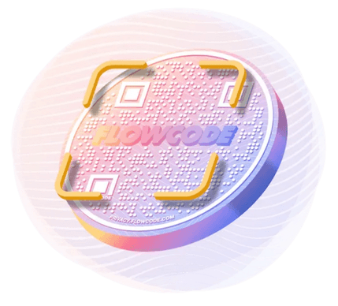

## Dynamic QR code generator - Create and manage Flowcodes at scale! 🚀

  

The **Flowcode API** is a **RESTful API** that lets you programmatically leverage the Flowcode platform:

* 🚀 Create and manage (dynaymic QR) Flowcodes at scale
* 📈 Extract real-time analytics data from your Flowcodes and Flowpages
* ♾️ Seamlessly integrate the API into your application

### Getting Started

1. Create a free Flowcode account at [Flowcode.com ➜](https://flowcode.com/) and a developer account via the 🛠️ [Developer Portal ➜](https://developer.flowcode.com/)
2. **Authorization**: generate an `API key` (via the Developer Portal) to use as authorization for the API endpoints.

### Examples

💻 Check out code examples with the API [here](code-examples)

### Guides

* [Embed a Flowcode Generator in your application ➜](https://developer.flowcode.com/guides/embed-a-flowcode-generator)
* [Bulk Generate 1:1 Codes ➜](https://developer.flowcode.com/guides/bulk-generate-codes)
* [Ingest Flowcode and Flowpage data into your ETL pipeline ➜](https://developer.flowcode.com/guides/ingest-analytics-data)
* [Best Practices for Flowcode Design (via API) ➜](https://developer.flowcode.com/guides/flowcode-api-design-guidelines)

### API Endpoints

Please visit our 🛠️ [Developer Portal ➜](https://developer.flowcode.com/) for more information about each API endpoint and try our interactive test environment.

### Flowcode (dynamic QR) API Endpoints

| API               | Endpoint URL                                        | Type  | Description                                          |
| ----------------- | --------------------------------------------------- | ----- | ---------------------------------------------------- |
| Create a Flowcode | `https://gateway.flowcode.com/v4/codes`           | POST  | Creates a Flowcode                                   |
| Get All Flowcodes | `https://gateway.flowcode.com/v4/codes`           | GET   | Returns a list of Flowcodes accessible by this user  |
| Fetch Flowcode    | `https://gateway.flowcode.com/v4/codes/{code_id}` | GET   | Returns metadata for a specified Flowcode            |
| Update Flowcode   | `https://gateway.flowcode.com/v4/codes/{code_id}` | PATCH | Updates a Flowcode according to specified parameters |

### Flowcode (dynamic QR) Bulk API Endpoints

| API                           | Endpoint URL                                                    | Type | Description                                                  |
| ----------------------------- | --------------------------------------------------------------- | ---- | ------------------------------------------------------------ |
| Create Flowcodes in bulk      | `https://gateway.flowcode.com/v4/codes/bulk`                  | POST | Create codes in bulk using a single request                  |
| Update codes in bulk          | `https://gateway.flowcode.com/v4/codes/bulk`                  | PUT  | Update codes in bulk using a single request                  |
| Create codes in bulk from CSV | `https://gateway.flowcode.com/v4/codes/bulk/csv`              | POST | Create codes in bulk from CSV (comma-separated values) input |
| View status of bulk request   | `https://gateway.flowcode.com/v4/codes/bulk/{task_id}/status` | GET  | View the status of an asynchronous bulk request              |

### Flowcode Image Generation API Endpoints

| API                         | Endpoint URL                                                  | Type | Description                                                 |
| --------------------------- | ------------------------------------------------------------- | ---- | ----------------------------------------------------------- |
| Generate static code image  | `https://gateway.flowcode.com/v3/codes/generator/static`    | GET  | Generate a static Flowcode image                            |
| Generate dynamic code image | `https://gateway.flowcode.com/v3/codes/generator/{code_id}` | GET  | Generate a dynamic Flowcode image from an existing Flowcode |

### Flowcode Code Templates API Endpoints

| API                     | Endpoint URL                                       | Type | Description                                                                |
| ----------------------- | -------------------------------------------------- | ---- | -------------------------------------------------------------------------- |
| List Flowcode Templates | `https://gateway.flowcode.com/v3/code-templates` | GET  | Returns a list of Flowcode template configurations accessible by this user |
| Fetch Flowcode Template | `https://gateway.flowcode.com/v3/{template_id}`  | GET  | Returns metadata for a specified Flowcode template                         |

### Analytics API Endpoints

| API                 | Endpoint URL                                                  | Type | Description                                                       |
| ------------------- | ------------------------------------------------------------- | ---- | ----------------------------------------------------------------- |
| Get Flowcode Events | `https://gateway.flowcode.com/analytics/v2/events/flowcode` | GET  | Get events for all of your Flowcodes                              |
| Get Flowpage Events | `https://gateway.flowcode.com/analytics/v2/events/flowpage` | GET  | Get events for all of your Flowpages                              |
| Get Contacts (CRM)  | `https://gateway.flowcode.com/analytics/v2/contacts`        | GET  | Get contact info submitted on Flowpages for a specific date range |

[**Full List of Analytics API Endpoints ➜**](https://developer.flowcode.com/)

---

### 🤝 Get in Touch / Help:

- `help-api@flowcode.com`

### 💡 Rate Limiting

The Flowcode API sets a limit of 100 API requests per second. Once this limit is reached the API will start returning errors with HTTP status code 429.

### 💫 Difference between a regular QR code vs. a Flowcode?

  

* Dynamic and can be customized with a variety of designs
* Get real-time data and analytics, including advanced Geolocation tracking
* Enterprise-grade security and features, GDPR and CCPA compliant
* Platform features include management of Flowcodes, innovative artist designed Flowcodes, and mobile-first online destinations

Learn more at [Flowcode.com ➜](https://www.flowcode.com/)

